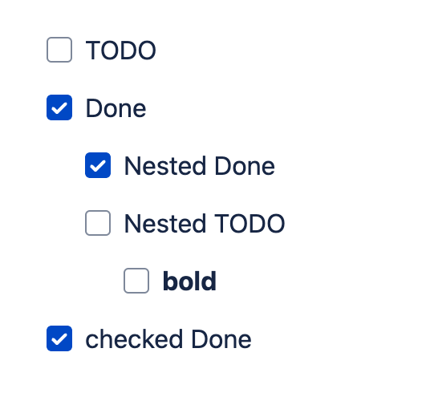

# asciidoctorj-confluence-extensions

[asciidoctorj](https://github.com/asciidoctor/asciidoctorj) extension collections
for [confluence-publisher](https://github.com/confluence-publisher/confluence-publisher).

## How to use

See [example](./example/).

In short, include in [asciidoc-confluence-publisher-maven-plugin](https://confluence-publisher.atlassian.net/wiki/spaces/CPD/overview)'s dependency like below.

```
...
    <build>
        <plugins>
            <plugin>
                <groupId>org.sahli.asciidoc.confluence.publisher</groupId>
                <artifactId>asciidoc-confluence-publisher-maven-plugin</artifactId>
                <version>0.16.0</version>
                <dependencies>
                    <dependency>
                        <groupId>me.cormoran</groupId>
                        <artifactId>asciidoctorj-confluence-extension-jira</artifactId>
                        <version>0.0.1</version>
                    </dependency>
                    <dependency>
                        <groupId>me.cormoran</groupId>
                        <artifactId>asciidoctorj-confluence-extension-task</artifactId>
                        <version>0.0.1</version>
                    </dependency>
                </dependencies>
                <configuration>
                    ...
                </configuration>
            </plugin>
        </plugins>
    </build>
...
```

## Jira macro

`asciidoctorj-confluence-extension-jira` provides custom inline macro `jira`, which is conveted
to [jira issues macro](https://confluence.atlassian.com/doc/jira-issues-macro-139380.html).

```asciidoc
= Jira

jira:CRM-1[]
```


## Task list

`asciidoctorj-confluence-extension-task`
provides [checklist](https://docs.asciidoctor.org/asciidoc/latest/lists/checklist/) to
jira's [task list](https://confluence.atlassian.com/conf59/add-assign-and-view-tasks-792498837.html) converter.

```asciidoc
= Task

* [ ] TODO
* [x] Done
** [x] Nested Done
** [ ] Nested TODO
*** [ ] *bold*
* [*] checked Done
```


